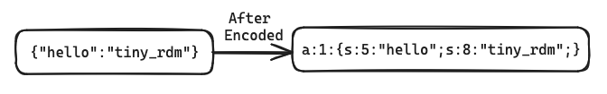
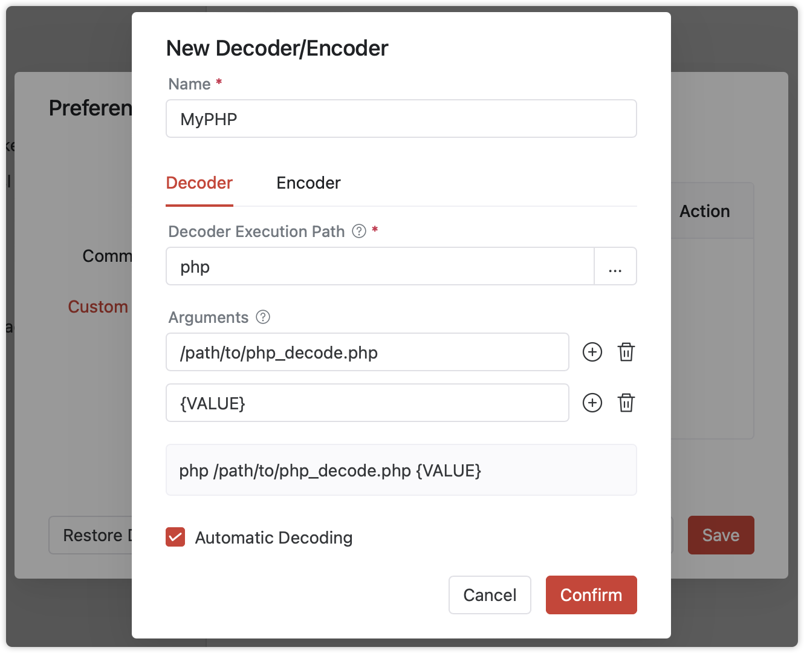
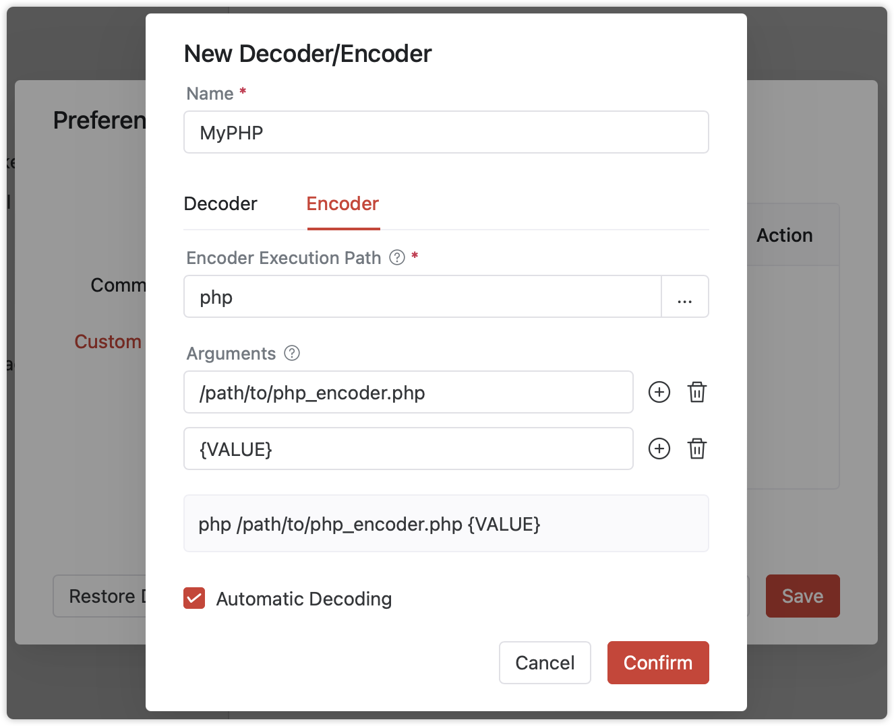

# Custom Decoders and Encoders

Tiny RDM provides some built-in decoders for universally standardized data decoding (including Base64, GZip, Deflate, ZStd, Brotli, Msgpack, and more.). But if you need to decode any non-standard data with personalized encoding, try our user-defined decoders and encoders.

## Related Concepts

`Decoder`：Converts the raw content retrieved from database into a human-readable format for display and editing.


`Encoder`：Converts the human-readable content back into the original raw data for saving.



## How It Works

Tiny RDM decodes and encodes by executing external cli applications.

To be able to transfer data between different processes, the raw data will encode into Base64 string before pass to the external application as a parameter, it will also return in Base64. If the external application fails to process the data (e.g., unable to decode), just simply return the plain text `[RDM-ERROR]`.

The basic input and output workflow looks like below:


## Creating and Using

Let's walk through an example of creating a PHP serializer and deserializer to demonstrate how to build and use custom decoders and encoders.

### Decoder

```php
<?php
$decoded = base64_decode($argv[1]);
if ($decoded !== false) {
    $obj = unserialize($decoded);
    if ($obj !== false) {
        $unserialized = json_encode($obj, JSON_UNESCAPED_UNICODE | JSON_UNESCAPED_SLASHES);
        if ($unserialized !== false) {
            echo base64_encode($unserialized);
            return;
        }
    }
}
echo '[RDM-ERROR]';
```

Save the above code as `php_decoder.php`, you can can be easily tested from the command line:

```shell
php /path/to/php_decoder.php YToxOntzOjY6IuS9oOWlvSI7czo4OiJ0aW55X3JkbSI7fQ==
```
::: info Tip

The input `YToxOntzOjY6IuS9oOWlvSI7czo4OiJ0aW55X3JkbSI7fQ==` is the Base64 encoding of `a:1:{s:6:"你好";s:8:"tiny_rdm";}`

:::

If it works correctly, it should output `eyLkvaDlpb0iOiJ0aW55X3JkbSJ9`, which is the Base64 encoding of the string `{"你好":"tiny_rdm"}`.

### Encoder

Based on the decoder example, let's implement the encoder logic:

```php
<?php
$decoded = base64_decode($argv[1]);
if ($decoded !== false) {
    $json = json_decode($decoded, true);
    if ($json !== false) {
        $serialized = serialize($json);
        if ($serialized !== false) {
            echo base64_encode($serialized);
            return;
        }
    }
}
echo '[RDM-ERROR]';
```

Save this as php_encoder.php, tested with the command line:

```shell
php /path/to/php_encoder.php eyLkvaDlpb0iOiJ0aW55X3JkbSJ9
```
Until output `YToxOntzOjY6IuS9oOWlvSI7czo4OiJ0aW55X3JkbSI7fQ==`, both the custom decoder and encoder are ready.

### Usage

After building decoder and encoder, let's see how to use them on the command line. Since these are PHP scripts, they rely on the PHP runtime, so the usage is as follows:

- Decode execution command

```shell
php /path/to/php_decoder.php {VALUE}
```

- Encode execution command

```shell
php /path/to/php_encoder.php {VALUE}
```

::: info Tip

In addition to running scripts through their respective environments, you can also run any standalone executable binary file, as long as it provides a command-line interface.

:::

::: info 说明

- `/path/to`should be replaced with the directory where the script file is located.
- `{VALUE}`is a `placeholder` for the Base64 input content to be passed to the decoder or encoder.

:::

### Adding and Using

Open Tiny RDM, and navigate to `Preferences` => `Custom Decoders` => `Add Decoder/Encoder`. Fill in as shown below:



::: info Parameter Description

- **Name**: The name displayed in the decoder dropdown list.
- **Decoder** Execution Path: The path to the executable binary file. Since the above example requires executing a PHP script, set it to `php cli`.
- **Arguments**: The arguments required to execute the external program for decoding. The first argument is the path to the PHP file to be executed, and the second argument is a placeholder {VALUE} for the content to be decoded. If no placeholder is provided, the content will be passed as the last argument during execution.
- **Automatic Decoding**: When loading a piece of content whose type has not yet been recognized, attempts to decode using this decoder are prioritized.

:::

Similarly, fill the Encoder tab as follows:



After confirming the save, you can find your decode option in the list!


At this point, the custom decoder and encoder are complete. Try using them to open a redis key corresponding to the format~


