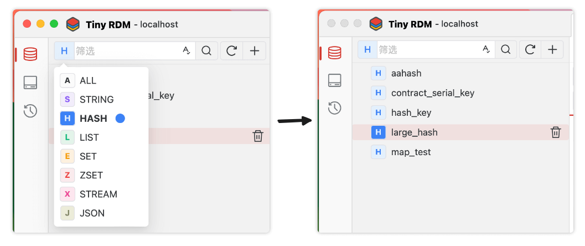
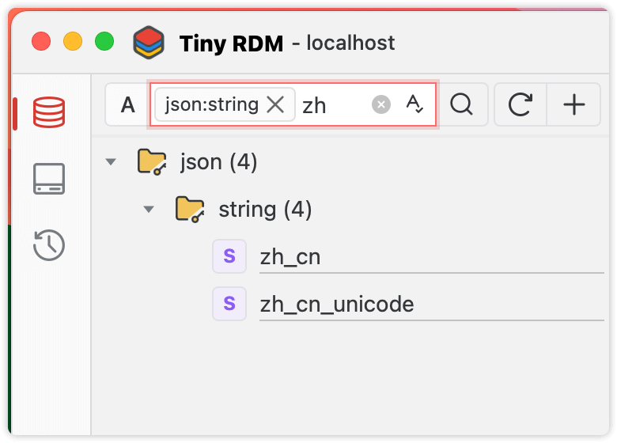

# Key Filtering and Matching Queries

The key list on the left side of Tiny RDM provides filtering and matching queries. By filtering and querying, you can quickly locate the keys you need, reducing unnecessary scanning.

## Filtering

Enter the keyword or phrase you want to find in the search input, either partially or completely. Once you have entered the text, without any further action, the loaded list will only display the keys containing the specified keyword.

## Querying

In addition to entering the keyword, a query operation requires you to press `Enter` or click the 🔍 button. After this, Tiny RDM will use the keyword to rescan and match the server data, and display the results after loading is complete. If the number of search results exceeds the single scan limit, you can click `Load More Keys` or `Load All Left Keys` to complete the batch loading.

In query status, the keywords are displayed as tags in the input box: 

### Type Matching

By using the type dropdown before the search input box, you can make Tiny RDM only scan keys of the specified type.

### Fuzzy Matching

By default, Tiny RDM will add the wildcard `*` as a prefix and suffix to the keywords before scanning. After pressing `Enter` to confirm the search keyword, the input bar status will be as follows, indicating that the fuzzy search is performed using the regular expression condition `*JSON*`:

### Exact Matching

When the exact match switch is on, no wildcards will added by Tiny RDM, it only performs an `EXISTS` command to exactly match the keywords.

## Combined Use (Filtering + Querying)

As long as it is properly used, the combination of filter + query can achieve the purpose of secondary filtering keys and speed up reaching the target key:

1. Select the type to query (optional)
2. Enter the keyword for fuzzy querying, and press `Enter` to confirm.
3. After the scan result set appears, input the keyword to filter again (no need to press `Enter` this time, pressing `Enter` again can replace the fuzzy query keyword in step 2)

