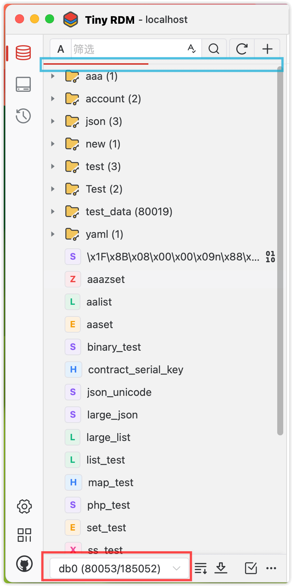
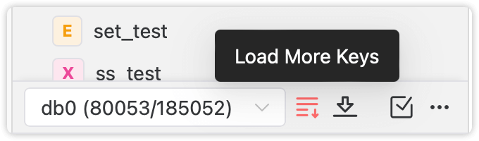
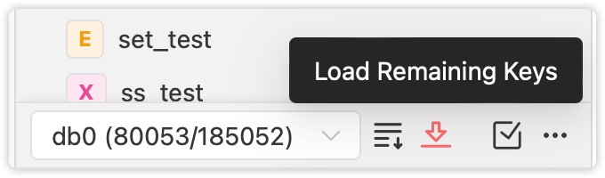
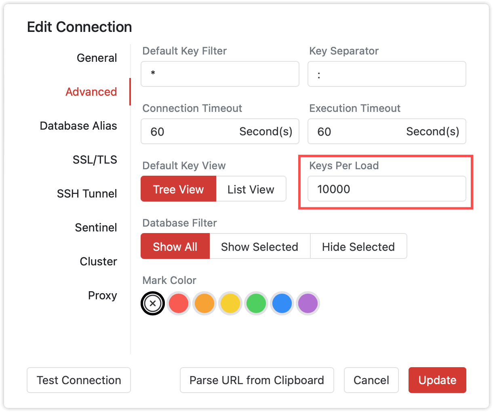

# Key Loading

Tiny RDM displays keys in a tree structure by default, and uses a delimiter (default is `:`) to split and display hierarchical levels.

## Segment Loading

Tiny RDM uses segment loading to prevent the UI from taking too long to load when there are massive keys on the server. When the number of keys on the server exceeds the set threshold (default is `10000`), it will stop loading the remaining portion.

As shown above, the blue box indicates the loading progress of the current number of keys, and the red box shows the number of keys loaded and the total number of keys.

If you need to load the remaining keys, you can use any of the following operations:

### Load More Keys

Each time you click `Load More Keys`, it will continue to load the next batch of keys.

### Load Remaining Keys

Load all the remaining keys at once.

### Set the Number of Keys Per Load

Go to `Connection Settings` -> `Advanced` -> `Keys Per Load`, you can set the number of keys to load each time. Setting a sufficiently large value will allow you to load all keys at once.

::: info Note

Loading too many keys at once may cause the UI of Tiny RDM to be blocked for a long time and cost certain resources on the server. If not necessary, try not to load too many keys at once.

Consider using [Key Filtering and Matching Queries](/guide/filter/) to quickly locate the keys you need to operate on.

:::
