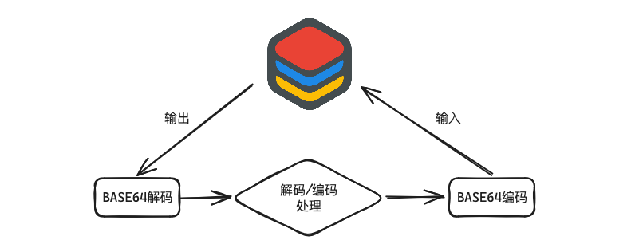
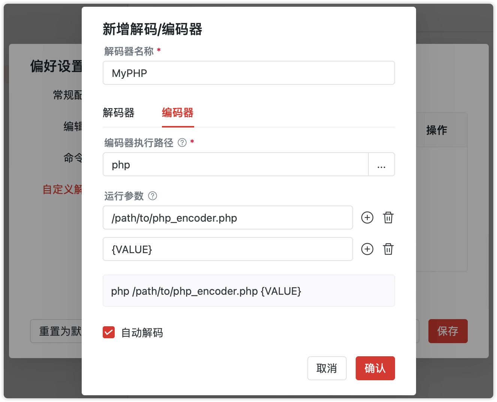

# 自定义解码/编码器

Tiny RDM除了内置部分常用的解码方式（包括Base64/GZip/Deflate/ZStd/Brotli/Msgpack等），也支持用户自定义解码器和编码器，来满足更复杂的数据解析。

## 相关概念术语

`解码器`：将数据库中读取到的原始内容，转换为友好的人类可读格式，便于展示和编辑。


`编码器`：将人类可读格式下的内容，重新转回原始数据，用于保存到数据库中。


## 工作原理

Tiny RDM通过执行外部应用程序来进行解码/编码操作。

为了方便不同开发语言和程序之间进行传输，原始数据会先进行Base64编码成字符串，再通过参数输出，经由外部应用程序的解码/编码处理后，同样以Base64形式输入。外部应用程序如果出现处理数据失败（如无法解码等情况），直接输出普通文本`[RDM-ERROR]`即可。

基本输入输出流程如下图：



## 创建使用示例

下面将以编写一个PHP序列化器和反序列化器为例子，来说明如何自行构建和使用`解码/编码器`。

### 解码器

```php
<?php
$decoded = base64_decode($argv[1]);
if ($decoded !== false) {
    $obj = unserialize($decoded);
    if ($obj !== false) {
        $unserialized = json_encode($obj, JSON_UNESCAPED_UNICODE | JSON_UNESCAPED_SLASHES);
        if ($unserialized !== false) {
            echo base64_encode($unserialized);
            return;
        }
    }
}
echo '[RDM-ERROR]';
```

将上面代码保存为文件`php_decoder.php`，可通过命令行进行简单测试：

```shell
php /path/to/php_decoder.php YToxOntzOjY6IuS9oOWlvSI7czo4OiJ0aW55X3JkbSI7fQ==
```
::: info 提示

此处输入的内容`YToxOntzOjY6IuS9oOWlvSI7czo4OiJ0aW55X3JkbSI7fQ==`为文本`a:1:{s:6:"你好";s:8:"tiny_rdm";}`的Base64编码

:::

如果逻辑正确，应该会输出`eyLkvaDlpb0iOiJ0aW55X3JkbSJ9`，即字符串`{"你好":"tiny_rdm"}`的Base64编码。

### 编码器

根据上面解码器的示例代码，我们来实现编码器的逻辑

```php
<?php
$decoded = base64_decode($argv[1]);
if ($decoded !== false) {
    $json = json_decode($decoded, true);
    if ($json !== false) {
        $serialized = serialize($json);
        if ($serialized !== false) {
            echo base64_encode($serialized);
            return;
        }
    }
}
echo '[RDM-ERROR]';
```

保存为文件`php_encoder.php`， 同样可以进行简单测试：

```shell
php /path/to/php_encoder.php eyLkvaDlpb0iOiJ0aW55X3JkbSJ9
```

如果一切顺利，将会输出`YToxOntzOjY6IuS9oOWlvSI7czo4OiJ0aW55X3JkbSI7fQ==`。到这一步，自行实现的解码器和编码器都已准备就绪。

### 使用方式

完成上面两步所创建的解码器和编码器，我们来总结下使用方式。 此处编写的是php脚本，依赖php运行，所以使用方式如下：

- 解码执行命令

```shell
php /path/to/php_decoder.php {VALUE}
```

- 编码执行命令

```shell
php /path/to/php_encoder.php {VALUE}
```

::: info 提示

除了通过对应环境运行脚本，也可以运行任意可独立执行的二进制文件，只要能提供命令行界面工具运行方式即可

:::

::: info 说明

- `/path/to/`需要替换成对应脚本文件所在目录
- `{VALUE}`为输入到解码器/编码器的原始内容Base64编码字符串`占位符`

:::

### 添加使用

打开Tiny RDM，依次打开`偏好设置`=>`自定义解码`=>`新增解码/编码器`，填写内容如下：


::: info 参数说明

- **解码器名称**：用于展示在解码下拉列表中的名称
- **解码器执行路径**：解码器可执行二进制文件所在路径。由于上述例子需要执行的是php脚本，所以将`php cli`作为执行文件
- **运行参数**：执行外部程序解码所需参数，此处第一个参数为需要执行的php文件路径，第二个为需解码的内容占位符，使用`{VALUE}`代替。如果不填写内容占位符，则会在执行期间将内容作为最后一个参数传入
- **自动解码**：当加载一段尚未被识别类型的内容时，会优先尝试使用此解码器进行解码

:::

同样的，编码器标签页的填写内容如下：



确认保存后，就可以在解码列表中找到这个编码选项了！


至此，自定义解码器和编码器都已完成，尝试使用它来打开一个对应编码的键吧~


