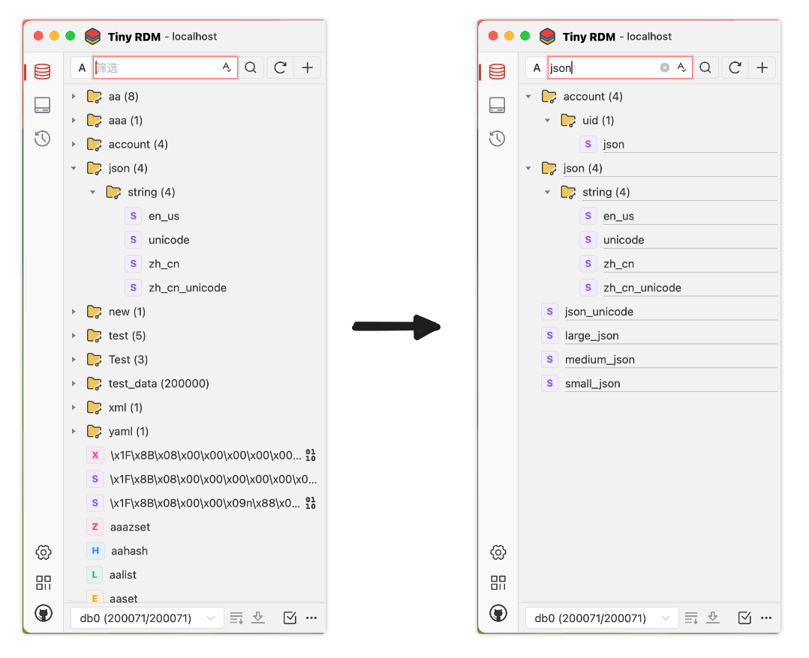
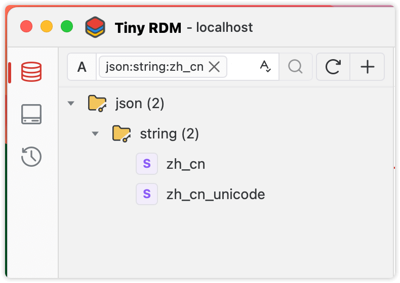
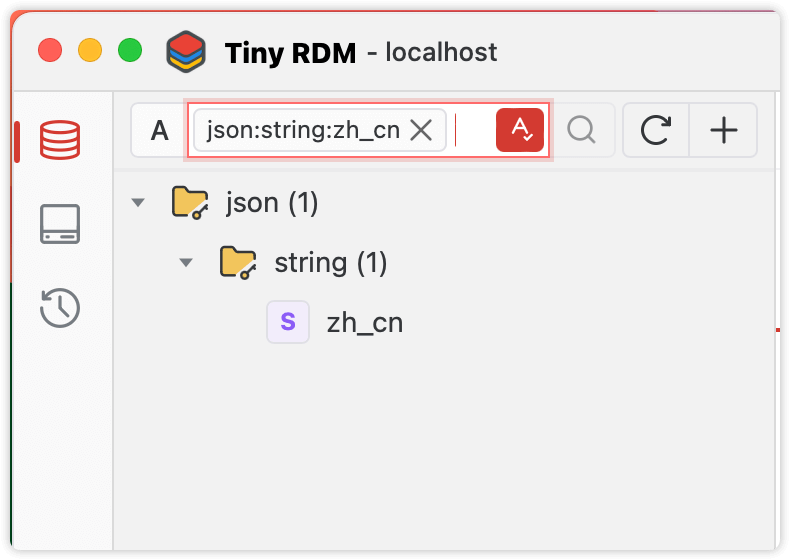

# 键筛选和匹配查询

Tiny RDM左侧的键列表提供了筛选和匹配查询的功能。通过筛选和查询，可以快速定位到你需要操作的键，减少额外的扫描。

## 筛选

在搜索输入框输入您想要查找的关键词或短语，部分或者全部都可以。输入完成无需其他操作，便会在已加载的列表中，只显示包含指定关键字的键。

## 查询

查询操作除了输入关键字，还需按下`回车`或者点击🔍按钮，此后Tiny RDM会使用关键字对服务器数据进行重新扫描和匹配，并在加载完成后在键列表中显示出来。如搜索结果集数量超出单次扫描设定，可以再次点击`加载更多键`或`加载剩余所有键`完成分批加载。

如需修改或替换已经输入的查询关键字，可以通过`双击`标签或者输入新的关键字并再次回车即可。

查询状态下的关键字会以标签形式显示在输入框：

### 类型匹配

通过搜索输入框前的类型下拉选择，可以让Tiny RDM只扫描指定类型的键。

### 模糊匹配

默认情况下无需加通配符，Tiny RDM会在扫描前为关键字加上通配符`*`前缀和后缀，来进行模糊匹配。`回车`确认搜索关键字后，输入栏状态如下，表示以正则条件`*JSON*`进行模糊检索：

### 完全匹配

选中完全匹配开关后，Tiny RDM的扫描不再为关键字加上通配符，仅通过`EXISTS`命令来完全匹配关键字。

## 组合应用（筛选+查询）

只要利用得当，筛选+查询组合就能达到二次过滤键的目的，加快触达目标键：

1. 选择需要查询的类型（可选）
2. 输入要模糊查询的关键字，并`回车`进行扫描。
3. 扫描结果集出现后，再次输入需要筛选的关键字（此时无需再按`回车`，再次`回车`可替换第2步的模糊查询关键字）

