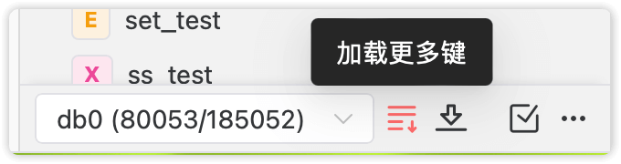
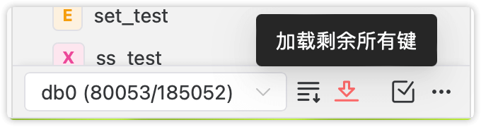
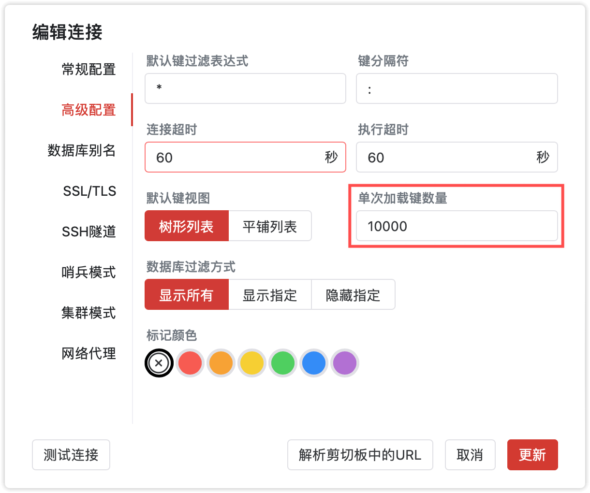

# 键加载

Tiny RDM默认以树形结构展示，并通过分隔符（默认为`:`）进行层级切分和展示。

## 分段加载

Tiny RDM使用分段加载的方式，用于防止服务器有海量键时界面加载太久的情况。当服务器中的键数量超过设定的阈值（默认`10000`）时，会停止加载剩余部分。

如上图所示，其中蓝色框选部分为当前键数量加载进度条，红色框选部分为键已加载数量和总数量。

此时如需要加载剩余全部键，你可以使用以下任意操作：

### 加载更多键

每次点击`加载更多键`都会继续加载下一批键。

### 加载剩余所有键

一次性将剩余的键全部加载出来。

### 设定单次加载数量

通过编辑连接，进入`连接设置`->`高级配置`->`单次加载键数量`，可以设定每次加载键的数量。设定一个足够大的值，就可以达成一次性加载所有键的目的。

::: info 注意

一次加载太多的键可能会导致Tiny RDM的操作界面长时间阻塞，也会对服务器的资源造成一定的占用，如无必要尽量不要一次性加载过多的键。

可以考虑配合[键的查询和筛选](/zh/guide/filter/)来快速定位到你所需操作的键。

:::
